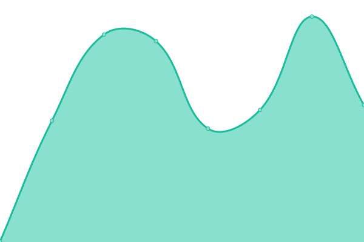

# [📈 Live Status](https://ccmbioinfo.github.io/status): <!--live status--> **🟧 Partial outage**

This repository contains the open-source uptime monitor and status page for [Centre for Computational Medicine at SickKids](https://ccm.sickkids.ca), powered by [Upptime](https://github.com/upptime/upptime).

With [Upptime](https://upptime.js.org), you can get your own unlimited and free uptime monitor and status page, powered entirely by a GitHub repository. We use [Issues](https://github.com/ccmbioinfo/status/issues) as incident reports, [Actions](https://github.com/ccmbioinfo/status/actions) as uptime monitors, and [Pages](https://ccmbioinfo.github.io/status) for the status page.

<!--start: status pages-->
<!-- This summary is generated by Upptime (https://github.com/upptime/upptime) -->
<!-- Do not edit this manually, your changes will be overwritten -->
<!-- prettier-ignore -->
| URL | Status | History | Response Time | Uptime |
| --- | ------ | ------- | ------------- | ------ |
|  [Main site](https://ccm.sickkids.ca) | 🟩 Up | [main-site.yml](https://github.com/ccmbioinfo/status/commits/HEAD/history/main-site.yml) | 

 429ms
     
 | 

<a href="https://status.ccm.sickkids.ca/history/main-site">100.00%</a>
    

|  [EpigenCentral](https://epigen.ccm.sickkids.ca) | 🟩 Up | [epigen-central.yml](https://github.com/ccmbioinfo/status/commits/HEAD/history/epigen-central.yml) | 

 265ms
     
 | 

<a href="https://status.ccm.sickkids.ca/history/epigen-central">100.00%</a>
    

|  [Keycloak](https://sso.ccm.sickkids.ca) | 🟥 Down | [keycloak.yml](https://github.com/ccmbioinfo/status/commits/HEAD/history/keycloak.yml) | 

 0ms
     
 | 

<a href="https://status.ccm.sickkids.ca/history/keycloak">0.00%</a>
    

|  [MinIO (primary)](https://minio.ccm.sickkids.ca/minio/health/live) | 🟩 Up | [min-io-primary.yml](https://github.com/ccmbioinfo/status/commits/HEAD/history/min-io-primary.yml) | 

 217ms
     
 | 

<a href="https://status.ccm.sickkids.ca/history/min-io-primary">100.00%</a>
    

|  [MinIO (Hiraki lab)](https://minio-hiraki.ccm.sickkids.ca/minio/health/live) | 🟩 Up | [min-io-hiraki-lab.yml](https://github.com/ccmbioinfo/status/commits/HEAD/history/min-io-hiraki-lab.yml) | 

 191ms
     
 | 

<a href="https://status.ccm.sickkids.ca/history/min-io-hiraki-lab">100.00%</a>
    

|  [MRSpec Portal](https://mrspec.ccm.sickkids.ca) | 🟩 Up | [mr-spec-portal.yml](https://github.com/ccmbioinfo/status/commits/HEAD/history/mr-spec-portal.yml) | 

 303ms
     
 | 

<a href="https://status.ccm.sickkids.ca/history/mr-spec-portal">93.07%</a>
    

|  [Seqr](https://seqr.ccm.sickkids.ca) | 🟩 Up | [seqr.yml](https://github.com/ccmbioinfo/status/commits/HEAD/history/seqr.yml) | 

 205ms
     
 | 

<a href="https://status.ccm.sickkids.ca/history/seqr">100.00%</a>
    

|  [Stager (frontend)](https://stager.ccm.sickkids.ca) | 🟩 Up | [stager-frontend.yml](https://github.com/ccmbioinfo/status/commits/HEAD/history/stager-frontend.yml) | 

 232ms
     
 | 

<a href="https://status.ccm.sickkids.ca/history/stager-frontend">100.00%</a>
    

|  [Stager (Hiraki backend)](https://stager-hiraki.ccm.sickkids.ca/api) | 🟩 Up | [stager-hiraki-backend.yml](https://github.com/ccmbioinfo/status/commits/HEAD/history/stager-hiraki-backend.yml) | 

 256ms
     
 | 

<a href="https://status.ccm.sickkids.ca/history/stager-hiraki-backend">100.00%</a>
    

<!--end: status pages-->

[**Visit our status website →**](https://ccmbioinfo.github.io/status)

## 📄 License

- Powered by: [Upptime](https://github.com/upptime/upptime)
- Code: [MIT](./LICENSE) © [Centre for Computational Medicine at SickKids](https://ccm.sickkids.ca)
- Data in the `./history` directory: [Open Database License](https://opendatacommons.org/licenses/odbl/1-0/)
